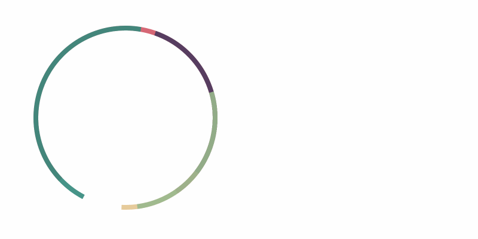

# the-ring
Interactive home page animation for my personal website.
It tracks current position of the cursor, and respond to it.
The laws of physics apply here, therefore small pieces move differently compared to the big ones.

